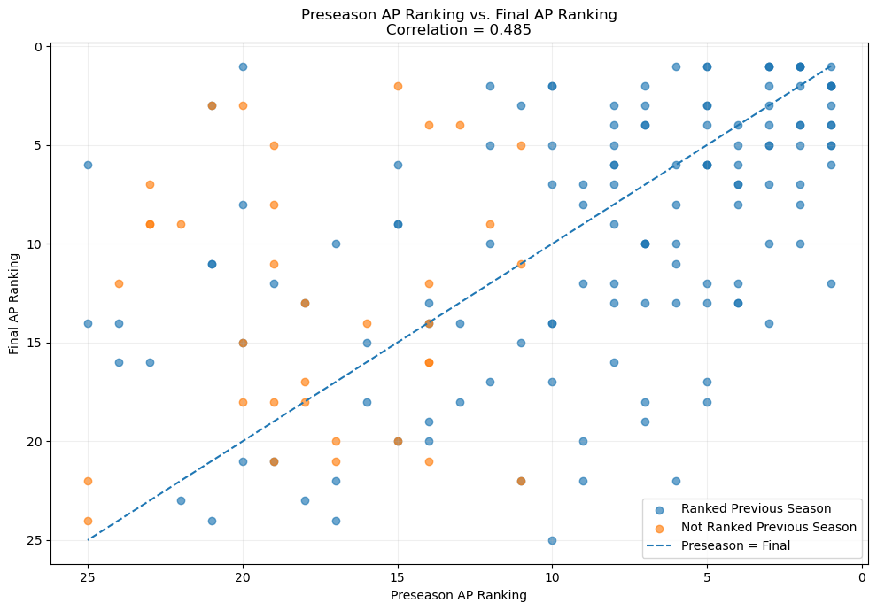
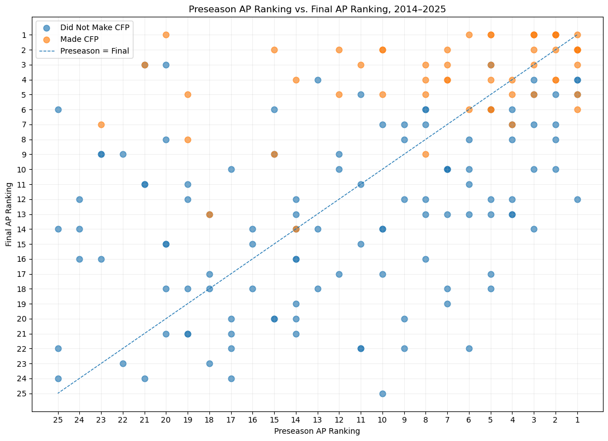
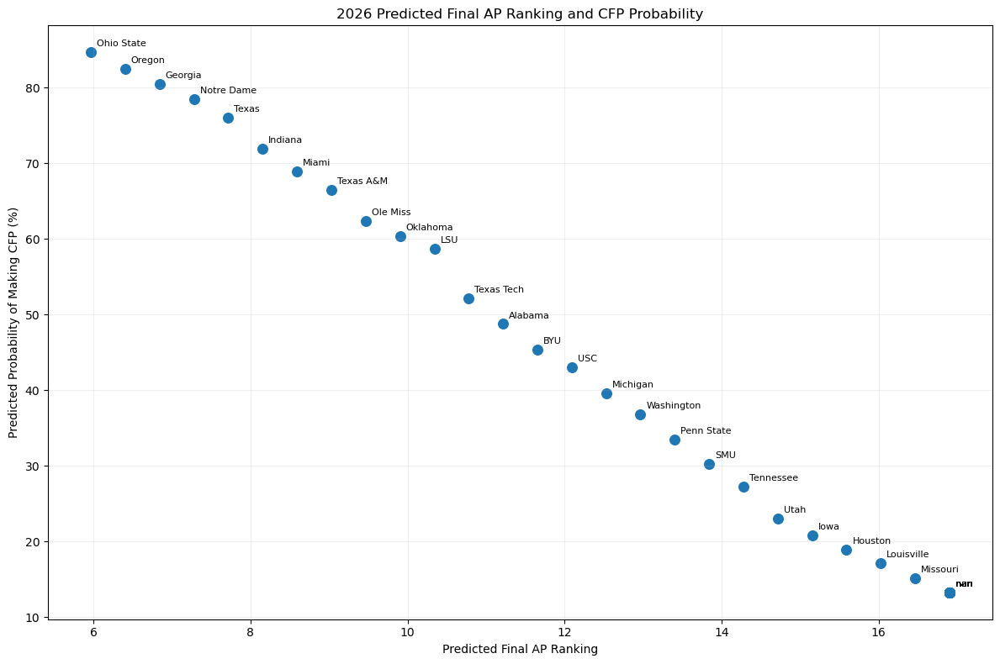

# Predicting College Football Rankings and Playoff Outcomes

## Research Question
How well can preseason information be used to predict a college football team's final AP ranking and whether it makes the College Football Playoff?

## Background and Context
College football writers vote every week of the season, from the preseason to the end of the season, on who the top 25 teams in the country are, and the votes are added up to produce a top 25 ranking. The main poll for the season is the AP Poll, which has been running since 1936. In the preseason, it attempts to rank the 25 teams based on little information, such as the previous season's record, name brand, recruiting, and the transfer portal. But this ranking often produces many teams that end up struggling, and fail to remain ranked by the end of the season. At the end of the season, 12 teams, generally the 12 best teams in the country, make it to the College Football Playoff, and one final AP ranking comes out following the playoffs. Every season includes several preseason ranked teams who do not stay ranked, and also postseason ranked teams that did not begin ranked. So how can we find a correlation to how the preseason ranking and final ranking, or more particularly, whether they make the College Football Playoff?
This project is a machine learning project to find a regression problem that predicts a team's final Associated Press (AP) ranking at the end of the season. The second is a classification problem that predicts whether a team makes the College Football Playoff (CFP).

## Dataset
Due to the College Football Playoffs being founded in 2014, the dataset will include all teams from 2014 to the most recently completed season, 2025. We can also look at the 2026 preseason poll to determine teams odds at making the CFP.
The dataset, found from Wikipedia, includes the preseason AP poll and final AP poll from each season, and teams to make the College Football Playoff. It also includes the previous season's final ranking for each team (so the 2014 rankings uses the 2013 final poll).
The initial dataset contains 430 team-season observations. Because the regression target requires a final AP ranking, the regression analysis uses 300 observations for teams that received a final AP ranking. The classification analysis uses the larger 430-observation dataset.
The dataset contains some missing AP rankings because not every team was ranked in the AP Top 25 at the beginning or end of a season. These missing rankings were handled during the data-preparation process rather than simply removing those observations.

## Variables
The variables used in this project were:
- preseason_ap
- previous_final_ap
- final_ap_rank
- made_playoff

Preseason_AP: this represents a teams initial ranking in the preseason poll, before any games have taken place, for a given season. A lower value represents a better ranking (1 is the best, 25 is the worst. However, due to only 25 out of over 120 teams being ranked, 25 is still very good). Unranked teams were assigned a value of 26.
Previous_Final_AP: this represents a teams final ranking from the prior season. So 2017 Alabama will use the final ranking of 2016 Alabama. Again, unranked teams were assigned a value of 26.
Final_AP_Rank: this represents a teams final ranking from the given season, from the same season that the preseason ranking is used. This is the target variable for the regression problem.
Made_playoff: This is a binary to represent whether a team made the College Football Playoff. A value of 1 indicates that they made the playoffs, and a value of 0 indicates that they did not. From 2014 to 2023, only 4 teams made the playoffs, and from 2024 to 2025, 12 teams made it. This is a total of 64 teams to make the CFP. This is the target variable for the classification problem.

## Data Understanding and Exploration
Before developing the machine-learning models, I explored the distribution of the variables and examined how preseason expectations and previous-season performance related to the eventual outcomes.

The classification dataset contains 430 team-season observations. Of these observations, 64 teams (14.9%) made the College Football Playoff, while 366 teams (85.1%) did not. This represents a substantial class imbalance. Because relatively few observations belong to the playoff class, accuracy alone would not be a sufficient measure of classification performance. This influenced my decision to also use precision, recall, F1 score, and ROC-AUC when evaluating the classification models.

The AP ranking variables also showed an important characteristic: lower ranking numbers represent better rankings. For example, a preseason ranking of 1 indicates a team was ranked first, while a value of 25 indicates the team was ranked 25th. Teams that were not ranked in the AP Top 25 were represented by a value of 26. This allowed unranked teams to remain in the analysis rather than being removed.

The data also suggest a relationship between preseason expectations and final performance. Teams with stronger preseason AP rankings generally tended to finish with stronger final AP rankings. Previous-season AP rankings provided additional information about a team's recent performance, although their relationship with the final ranking appeared weaker than the preseason ranking.

For the classification problem, the same pattern was expected: teams receiving stronger preseason rankings generally had a greater likelihood of reaching the College Football Playoff. However, preseason rankings were not perfect predictors, since teams can substantially outperform or underperform expectations during a season. Teams who started a season unranked still occasionally made the playoffs, especially in the expanded 2024 and 2025 playoffs.

I used visualizations to examine these relationships before modeling. These included distributions of AP rankings, comparisons of preseason and final rankings, and visualizations of the playoff outcome. The exploration showed that the dataset was not evenly distributed across the classification target and that preseason AP ranking was likely to be an important predictor.

These findings informed the feature-selection process. I retained preseason AP ranking and previous-season final AP ranking because both variables are available before the season's final outcome and provide information about preseason expectations and recent performance. Variables that would only become available after the season began were excluded because using them would introduce information that would not actually be available when making a preseason prediction.

## Data Cleaning and Preparation
The data was cleaned and prepared before training the machine-learning models. Team names were standardized so that teams could be matched across seasons, and duplicate team-season observations were checked. For example, searching for Alabama could show South Alabama as well, so they had to be split. No duplicate observations were found.

Because AP rankings are only published for the Top 25 teams, some teams did not have a preseason or previous-season final ranking. Rather than removing these observations, I represented an unranked team with a value of 26, indicating that it was outside the AP Top 25. This allowed unranked teams to remain in the analysis. While unranked teams still can receive votes to be ranked, they still are unranked, even when they are ranked 26th in the poll, just one spot away from being ranked.

For the regression analysis, observations without a final AP ranking were excluded because a final numerical ranking was required as the target. The classification analysis retained the larger dataset because the playoff outcome could still be identified.

## Visualizations

This graph compares each team's preseason AP ranking with its final AP ranking from 2014-2025. Only teams that received a preseason AP ranking are included. Blue dots represent teams that were ranked in the previous season's final AP poll, while orange dots represent teams that were not ranked in the previous season. The dashed line represents teams finishing exactly where they were predicted to finish. Points below the line indicate teams that finished better than their preseason ranking, while points above the line indicate teams that finished worse than expected. Because a lower AP ranking represents a better ranking, both axes are inverted.

The correlation between preseason and final AP ranking is 0.485, indicating a moderate positive relationship. This suggests that teams ranked highly in the preseason generally tended to finish higher in the final AP poll, although there was substantial variation in how teams actually performed. The distinction between blue and orange dots provides additional context about whether teams had been ranked the previous season. Overall, the graph shows that preseason rankings contain useful information about final rankings, but they are far from perfectly predictive.

This graph compares each team's preseason AP ranking with its final AP ranking from 2014–2025, with points separated by whether the team made the College Football Playoff. Teams that made the CFP are shown in blue, while teams that did not make the CFP are shown in orange. The dashed line represents teams finishing exactly where they were predicted to finish. Points below the line represent teams that finished better than their preseason ranking, while points above the line represent teams that finished worse than expected. Because lower AP rankings represent better performance, both axes are inverted.

The graph shows that CFP teams were generally concentrated among teams with strong preseason rankings and strong final rankings. However, preseason ranking was not a guarantee of playoff success. Some highly ranked preseason teams failed to make the CFP, while some teams that were ranked lower in the preseason improved enough to reach the playoff. This demonstrates why preseason information can be useful for predicting playoff participation, but cannot perfectly predict which teams will ultimately qualify.

This graph shows the model's predictions for the 2026 college football season. Each point represents a team, with the team's predicted final AP ranking on the x-axis and its predicted probability of making the College Football Playoff on the y-axis. The final AP ranking predictions come from the linear regression model, while the CFP probabilities come from the logistic regression model. Team names are included next to each point to identify the predictions.

Teams toward the left side of the graph have better predicted final AP rankings, while teams toward the top have higher predicted probabilities of making the CFP. Therefore, teams in the upper-left portion of the graph have the strongest combination of predicted final ranking and playoff probability. These predictions are based only on preseason AP ranking and the previous season's final AP ranking, so they should be interpreted as model estimates rather than predictions that account for factors such as injuries, schedule strength, recruiting, or in-season performance.

## Baseline and Model Development
I established a baseline for each prediction task before training the machine-learning models. For the regression problem, the baseline predicted the mean final AP ranking for every team. For the classification problem, the baseline always predicted the most common outcome, which was that a team would not make the College Football Playoff. These baselines provide simple reference points for determining whether the machine-learning models provide useful improvement.

For the regression task, I compared Linear Regression and Random Forest Regression. Linear Regression was selected because it provides a simple and interpretable way to model the relationship between the AP predictors and final ranking. Random Forest was included as a more flexible model capable of capturing nonlinear relationships.

For the classification task, I compared Logistic Regression and Random Forest Classification. Logistic Regression was appropriate because the target is a binary outcome, while Random Forest provided a nonlinear alternative.

The models were trained using the same predictors and chronological training and validation data so that their performance could be compared fairly. I used a minimum leaf size of 3 and 300 trees for the Random Forest models. The classification models also used balanced class weights because only 14.9% of the observations represented playoff teams.

Model selection was based on performance on the 2023-2024 validation period rather than the final 2025 test set. This prevented the test season from influencing the choice of model.

## Model Evaluation and Selection
Different evaluation metrics were used for the two prediction tasks. For regression, I used Mean Absolute Error (MAE), Root Mean Squared Error (RMSE), and R². MAE represents the average number of ranking positions by which predictions differ from the actual result, while RMSE gives greater weight to larger errors. R² measures how much of the variation in final AP ranking is explained by the model.

For classification, I used accuracy, precision, recall, F1 score, and ROC-AUC. Because playoff teams represented only 14.9% of the dataset, accuracy alone could be misleading. Recall and F1 score were particularly important because they measure how effectively the model identifies playoff teams.

### Regression Results
| Model | MAE | RMSE | R² |
|---|---:|---:|---:|
| Mean Baseline | 6.240 | 7.211 | 0.000 |
| Linear Regression | 5.008 | 5.712 | 0.373 |
| Random Forest | 5.218 | 6.163 | 0.270 |

Linear Regression performed best on the validation data, achieving the lowest MAE and RMSE and the highest R². I therefore selected Linear Regression as the final regression model. After selecting the model, it was retrained using the 2014–2024 seasons and evaluated on the previously unseen 2025 season. The final model had a 2025 MAE of 4.701, RMSE of 5.935, and R² of 0.323.

### Classification Results
| Model | Accuracy | Precision | Recall | F1 | ROC-AUC |
|---|---:|---:|---:|---:|---:|
| Majority Baseline | 0.775 | 0.000 | 0.000 | 0.000 | 0.500 |
| Logistic Regression | 0.746 | 0.455 | 0.625 | 0.526 | 0.705 |
| Random Forest | 0.789 | 0.545 | 0.375 | 0.444 | 0.643 |

Although Random Forest had higher accuracy, Logistic Regression performed better on recall, F1 score, and ROC-AUC. Since identifying playoff teams was more important than simply predicting the majority class, I selected Logistic Regression as the final classification model.

When retrained on the 2014–2024 seasons and tested on 2025, Logistic Regression achieved an accuracy of 0.595, precision of 0.385, recall of 0.417, F1 score of 0.400, and ROC-AUC of 0.607.

Overall, the validation results supported Linear Regression for predicting final AP ranking and Logistic Regression for predicting playoff qualification. The 2025 results provide a final test of these selections on a season that was not used during model development or selection.

## Model Interpretation and Insights
The model coefficients provide insight into which preseason information was most useful for making predictions. In the Logistic Regression model, the preseason AP ranking was substantially more influential than the previous-season final AP ranking. The preseason AP coefficient was approximately -0.182, corresponding to an odds ratio of approximately 0.833. This means that, holding the previous-season ranking constant, a one-position decrease in preseason ranking was associated with approximately a 16.7% decrease in the estimated odds of making the College Football Playoff.

The previous-season final AP ranking had a much smaller coefficient of approximately -0.0035, indicating that it contributed relatively little additional predictive information once preseason AP ranking was included.

The Linear Regression model showed a similar pattern. Its coefficient for preseason AP ranking was approximately 0.409, meaning that a one-position worse preseason ranking was associated with an estimated 0.41-position worse final AP ranking, holding the previous-season ranking constant.

The classification confusion matrix also illustrates the model's strengths and weaknesses on the 2025 test set. Logistic Regression correctly identified 5 playoff teams and 19 non-playoff teams, while producing 6 false positives and 7 false negatives. The false negatives are particularly important because they represent teams that actually made the playoff but were not identified by the model.

Overall, the models suggest that preseason expectations contain meaningful information about eventual college football success. However, the predictions are far from perfect. A team's preseason ranking cannot account for unexpected changes during a season, such as injuries, player development, coaching changes, or unexpectedly strong or weak performance.

These results should therefore be interpreted as evidence of predictive relationships rather than proof that preseason AP rankings cause teams to finish at particular rankings or make the playoff.

## Ethics and Limitations
This project has several limitations that should be considered when interpreting the results. The dataset is based on AP rankings, so it primarily represents teams that received national attention rather than all FBS teams. Unranked teams were represented as a rank of 26, which is a modeling decision and does not mean that every unranked team was equally strong. The classification dataset was also imbalanced, with far more teams that did not make the CFP than teams that did.

Another limitation is that the model uses only preseason AP ranking and the previous season's final AP ranking. Important factors such as recruiting, returning players, schedule strength, injuries, coaching changes, and team performance during the season are not included. In addition, the CFP expanded from four teams to twelve teams in 2024, meaning that "making the playoff" was not defined identically throughout the entire dataset.

The predictions should therefore be viewed as estimates rather than guarantees. A false positive in the playoff model means the model predicts that a team will make the CFP when it does not, while a false negative means the model fails to identify a team that actually makes the CFP. Although these errors are not likely to cause serious harm in this context, they could lead to misleading conclusions if the model were treated as a definitive forecasting tool.

Finally, this project does not establish causation. The relationships identified by the models show patterns in the historical data, but they do not prove that preseason rankings or previous rankings cause teams to finish at particular positions or make the CFP.

## Conclusion
This project examined how well preseason information can be used to predict a college football team's final AP ranking and whether it makes the College Football Playoff. Using preseason AP ranking and previous-season final AP ranking, the models found that preseason ranking was the most useful predictor of both outcomes.

For final AP ranking, the linear regression model performed better than the random forest model, achieving a 2025 MAE of 4.70 and R² of 0.323. For playoff prediction, logistic regression was selected over the random forest model because it provided better recall, F1 score, and ROC-AUC during validation. On the 2025 test set, it correctly identified 5 of 12 playoff teams, with an overall accuracy of 59.5% and ROC-AUC of 0.607.

Overall, the results show that preseason expectations contain useful information about how teams will finish, but they cannot fully predict the outcome of a college football season. Adding factors such as team performance, recruiting, returning production, schedule strength, and injuries could potentially improve future versions of the models.

## Code and AI Transparency
The complete Python code used for data collection, cleaning, visualization, model development, evaluation, and prediction is available in the project notebook: 

ChatGPT was used as an AI assistance tool during this project to help with Python code debugging, data-processing strategies, visualization ideas, model interpretation, and drafting portions of the written report. I remained responsible for making decisions about the research question, variables, models, and analysis. I also ran and reviewed the code and used the resulting outputs to report the findings in this project.
